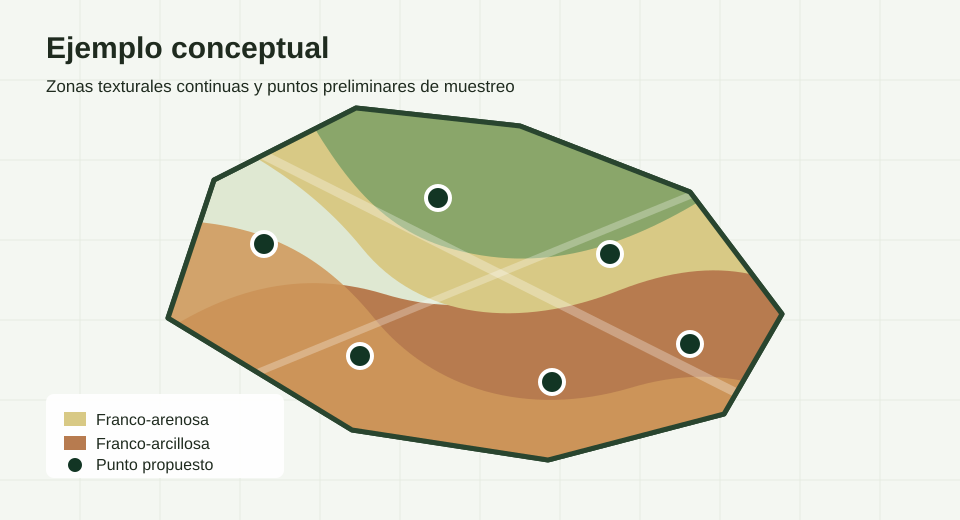

# Point Soil Sampler

[](https://pointsoilsampler-nzqz5m3sbjzuxxmwyappkrb.streamlit.app/)


https://pointsoilsampler-nzqz5m3sbjzuxxmwyappkrb.streamlit.app/

## Problema Que Resuelve

Point Soil Sampler ayuda a definir puntos preliminares de muestreo de suelos dentro de un poligono agricola. La app estima textura USDA desde fuentes reales de arena, limo y arcilla, vectoriza zonas texturales continuas y genera puntos, tablas y archivos GIS descargables.

La app no genera datos simulados: si una fuente remota no responde o no existen datos suficientes, el procesamiento se detiene.

## Innovacion O Aporte Tecnico

- Integra una interfaz Streamlit con fuentes globales de textura y salidas GIS listas para revision.
- Clasifica textura USDA a partir de fracciones normalizadas de arena, limo y arcilla.
- Compara fuentes globales base: OpenLandMap-soildb 120 m y SoilGrids250m / ISRIC WCS.
- Incluye un modo experimental Sentinel-2 + perfiles locales que entrena un `RandomForestRegressor` con WoSIS y/o calicatas Costa Rica y covariables multitemporales Sentinel-2 L2A.
- Exporta capas auxiliares de consistencia, observaciones Sentinel-2 de suelo descubierto, score de suelo descubierto e incertidumbre del modelo experimental.

## Metodologia Y Algoritmo

1. El usuario dibuja un poligono sobre el mapa satelital o sube un archivo GeoJSON.
2. Antes de procesar, el poligono activo se puede guardar o descargar como GeoJSON con nombre propio.
3. La app extrae arena, limo y arcilla desde la fuente seleccionada.
4. Las fracciones se normalizan a 100% y se clasifican en textura USDA.
5. Se crea un raster de clase textural, usando `0` solo como nodata.
6. El raster se vectoriza en poligonos continuos de clase textural.
7. Cada poligono continuo de clase textural se mantiene con el tamano resultante de la clasificacion.
8. Para cada poligono continuo de clase textural se genera un solo punto en su centroide.
9. Se crean archivos descargables y una carpeta local de salida por corrida.

## Fuentes De Datos

### OpenLandMap-soildb 120 m

Fuente predeterminada. Usa COGs globales de OpenLandMap-soildb para arena, limo y arcilla:

- Periodo: 2020-2022
- Profundidad: 0-30 cm
- Resolucion: 120 m
- CRS: EPSG:4326
- Estadisticos usados: `mean`, `p0.16` y `p0.84`
- Intervalo de prediccion: 68%, mayor que el umbral solicitado de 60%

La textura USDA principal se calcula con las capas `mean`. La app tambien lee `p0.16` y `p0.84` y exporta una mascara `consistencia_intervalo_68_120m.tif`: valor `1` cuando la clase USDA calculada con la media coincide con la clase calculada desde ambos extremos del intervalo, y `0` cuando no coincide o no hay dato. Esta mascara es un indicador derivado de consistencia, no una probabilidad oficial de clase.

### SoilGrids250m / ISRIC WCS

Fuente alternativa global para comparar resultados. Usa el servicio WCS de ISRIC SoilGrids:

- Variables: `sand`, `silt`, `clay`
- Profundidades: 0-5 cm, 5-15 cm y 15-30 cm
- Resolucion: 250 m
- Metodo 0-30 cm: promedio ponderado por espesor de cada intervalo

### Experimental Sentinel-2 + perfiles (WoSIS / calicatas CR)

Modo experimental para comparar contra las fuentes globales base. Entrena un modelo local `RandomForestRegressor` con observaciones reales de arena, limo y arcilla 0-30 cm y covariables Sentinel-2 L2A.

- Entrenamiento: perfiles WoSIS y/o calicatas Costa Rica (`Calicatas_01_02_21_Costa_Rica.csv`) con `sand`, `silt` y `clay`, filtrados a profundidad 0-30 cm.
- Selector en la app: `Solo WoSIS/ISRIC`, `Solo calicatas Costa Rica` o `WoSIS + calicatas Costa Rica` (predeterminado).
- Calicatas CR: ~7,434 perfiles usables a nivel nacional; se filtran al buffer de 250 km y se limitan a los ~400 mas cercanos al poligono para acotar Sentinel-2.
- La columna `Clase Textural` del CSV se conserva como referencia; el Random Forest predice fracciones y la app clasifica USDA despues.
- Descarga WoSIS: consulta el WFS por teselas con reintentos para reducir respuestas grandes o mal formadas.
- Area de entrenamiento: busca puntos conocidos dentro de un buffer de 250 km alrededor del poligono ingresado.
- Area Sentinel-2 de entrenamiento: usa el extent total de los perfiles encontrados para extraer covariables Sentinel-2 en esos puntos conocidos.
- Area de prediccion: estima arena, limo y arcilla solo dentro del poligono original, a 20 m, y unicamente en pixeles Sentinel-2 clasificados como suelo descubierto.
- Imagenes: escenas Sentinel-2 L2A disponibles en Microsoft Planetary Computer.
- Seleccion Sentinel-2: para entrenamiento prioriza escenas que cubren perfiles y, dentro de ellas, menor nubosidad; limita la corrida por defecto a 120 escenas para entrenamiento y 90 para prediccion.
- Tiempo de ejecucion: la creacion del modelo Sentinel-2 puede tardar bastante mas de 20 minutos porque descarga, lee y procesa muchas escenas y bandas para entrenamiento y prediccion.
- Acceso Sentinel-2: firma cada asset de Planetary Computer justo antes de leerlo y exige una vigencia minima para evitar tokens vencidos en corridas largas.
- Compuesto: usa SCL clase 5 como criterio fuerte de suelo no vegetado y un respaldo restringido con SCL clase 7; combina la mejor observacion y la media multitemporal de observaciones de suelo descubierto.
- Resolucion de salida: 20 m.
- Covariables: bandas visibles, NIR, SWIR e indices NDVI, SAVI, MSAVI, BSI, CI, NDWI, GEOI y BI, como mejor observacion y media multitemporal, mas ubicacion y conteo/score de suelo descubierto.
- Validacion: calcula metricas internas con validacion espacial por grupos cuando hay suficientes perfiles distribuidos.
- Postproceso: suaviza ligeramente las fracciones arena/limo/arcilla antes de clasificar USDA para reducir ruido salpicado de pixeles aislados.

## Datos De Entrada Y Formatos Soportados

- Poligono dibujado en el mapa de la app.
- Archivo `.geojson` o `.json` con geometria `Polygon` o `MultiPolygon`.
- Coordenadas de entrada esperadas en WGS84 / EPSG:4326.

No se requieren API keys, tokens, credenciales de Google Earth Engine ni archivos de autenticacion para la configuracion actual.

## Instalacion Y Ejecucion

```bash
pip install -r requirements.txt
streamlit run app.py
```

La app requiere conexion a internet para leer `s3.opengeohub.org`, `maps.isric.org` y, en el modo experimental, `planetarycomputer.microsoft.com`.

Las corridas largas se ejecutan como procesos en segundo plano dentro del servidor Streamlit. Si el navegador se desconecta temporalmente, por ejemplo al apagar la pantalla, el proceso puede continuar mientras el equipo y el servidor Streamlit sigan activos.

## Ejemplo Visual



El mapa de la app permite cargar o dibujar el poligono, ejecutar la clasificacion y visualizar zonas texturales junto con los puntos propuestos.

## Archivos De Salida

Cada corrida crea una carpeta en `salidas/muestreo_YYYYMMDD_HHMMSS/` con:

- `raster_textura_120m.tif` para OpenLandMap-soildb
- `raster_textura_250m.tif` para SoilGrids250m
- `raster_textura_20m_sentinel_wosis.tif` para el modo experimental Sentinel-2 + WoSIS
- `consistencia_intervalo_68_120m.tif` cuando se usa OpenLandMap-soildb
- `sentinel_suelo_descubierto_observaciones.tif` cuando se usa Sentinel-2 + WoSIS
- `sentinel_suelo_descubierto_score.tif` cuando se usa Sentinel-2 + WoSIS
- `incertidumbre_modelo_sentinel_wosis.tif` cuando se usa Sentinel-2 + WoSIS
- `zonas_texturales.geojson`
- `poligonos_muestreo.geojson`
- `puntos_muestreo.geojson`
- `puntos_muestreo.csv`
- `tabla_clases_textura.csv`
- `metadata_fuente.json`

La carpeta `salidas/` esta ignorada por Git para evitar subir archivos generados al repositorio. Los poligonos guardados antes de procesar se escriben en `salidas/poligonos/NOMBRE.geojson`.

## Clases Texturales USDA

La tabla exportada contiene exactamente 12 clases texturales:

| ID | Clase |
| --- | --- |
| 1 | Arenosa (Sand) |
| 2 | Arenosa-franca (Loamy sand) |
| 3 | Franco-arenosa (Sandy loam) |
| 4 | Franca (Loam) |
| 5 | Franco-limosa (Silt loam) |
| 6 | Limosa (Silt) |
| 7 | Franco-areno-arcillosa (Sandy clay loam) |
| 8 | Franco-arcillosa (Clay loam) |
| 9 | Franco-limo-arcillosa (Silty clay loam) |
| 10 | Areno-arcillosa (Sandy clay) |
| 11 | Limo-arcillosa (Silty clay) |
| 12 | Arcillosa (Clay) |

## Regla De Muestreo

La app genera un punto por cada poligono continuo de clase textural. No subdivide poligonos mayores de 85 ha y no suma poligonos separados de la misma clase.

Cada punto se ubica en el centroide del poligono textural correspondiente. El CSV de puntos incluye `zona_id`, `texture_id`, `Textura`, `area_zona_ha`, `metodo_punto`, `Lat` y `Lon`.

## Limitaciones Tecnicas

- Las fuentes globales no sustituyen muestreo de campo, cartografia local ni validacion agronomica.
- Sentinel-2 observa principalmente la superficie; no garantiza representar todo el intervalo 0-30 cm.
- Humedad, rastrojo, sombra, residuos de cultivo, nubosidad y cobertura vegetal pueden sesgar la estimacion.
- El modo Sentinel-2 experimental depende de que existan suficientes perfiles (WoSIS y/o calicatas CR) y pixeles Sentinel-2 de suelo descubierto.
- Las capas remotas pueden cambiar, quedar temporalmente fuera de servicio o limitar respuestas.
- En ejecucion local, el equipo no debe entrar en suspension durante corridas Sentinel-2 largas; apagar solo la pantalla no deberia detener el job si el servidor Streamlit sigue activo.
- Para uso operativo, conviene comparar OpenLandMap/SoilGrids/Sentinel-WoSIS y revisar incertidumbre o consistencia exportada.

## Roadmap

- Agregar pruebas automatizadas para clasificacion USDA, validacion de GeoJSON y escritura de salidas.
- Incorporar un ejemplo reproducible con datos sinteticos o anonimizados.
- Permitir configurar parametros del modo experimental desde la interfaz.
- Mejorar reportes de calidad del modelo y resumen de incertidumbre.
- Agregar soporte opcional para otros criterios de distribucion de puntos.

## Seguridad Y Publicacion

- No se versionan credenciales, secretos, archivos `.env`, credenciales de Google Earth Engine ni archivos de autenticacion.
- No se versionan resultados generados, GeoTIFF, shapefiles, geopackages, ortofotos, DEM, PDFs de referencia ni GeoJSON con datos reales de clientes.
- Antes de publicar cambios con datos reales, revisar tambien el historial de Git. Borrar un archivo en un commit no lo elimina de commits anteriores.

## Licencia Y Citacion Sugerida

Este proyecto se distribuye bajo licencia MIT. Ver [LICENSE](LICENSE).

Citacion sugerida:

```text
Soto Barquero, A. (2026). Point Soil Sampler: Streamlit app for preliminary soil texture sampling design. GitHub repository: https://github.com/asoto59g/Point_Soil_Sampler
```
